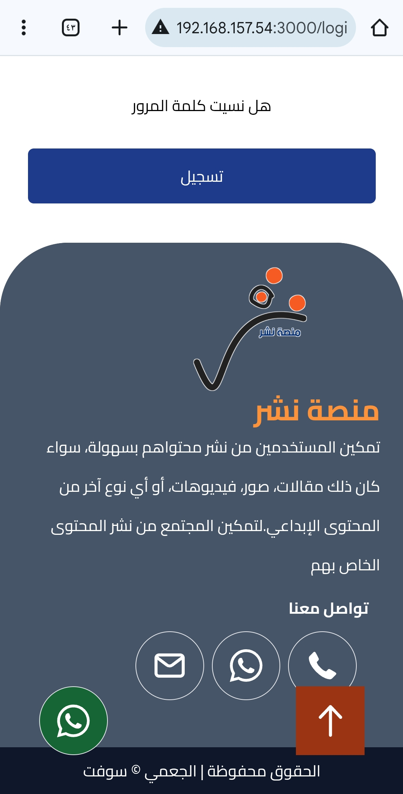
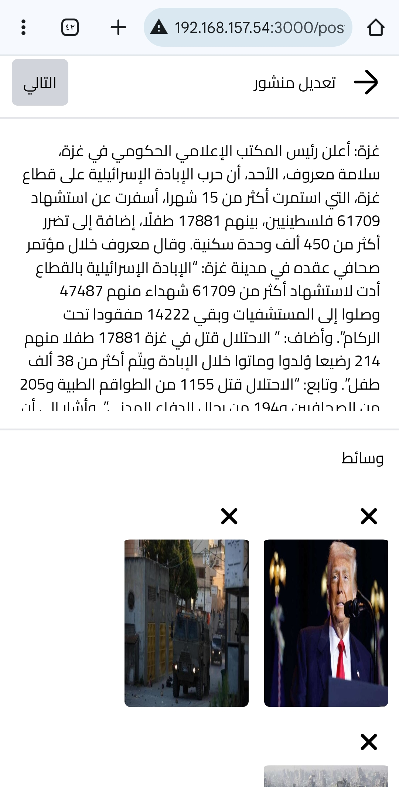
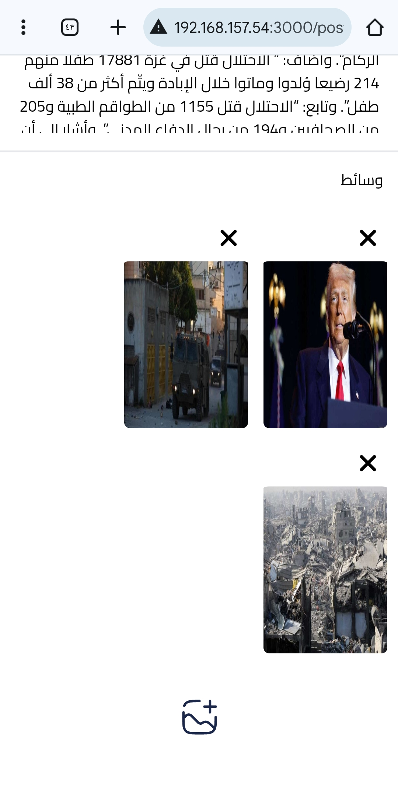
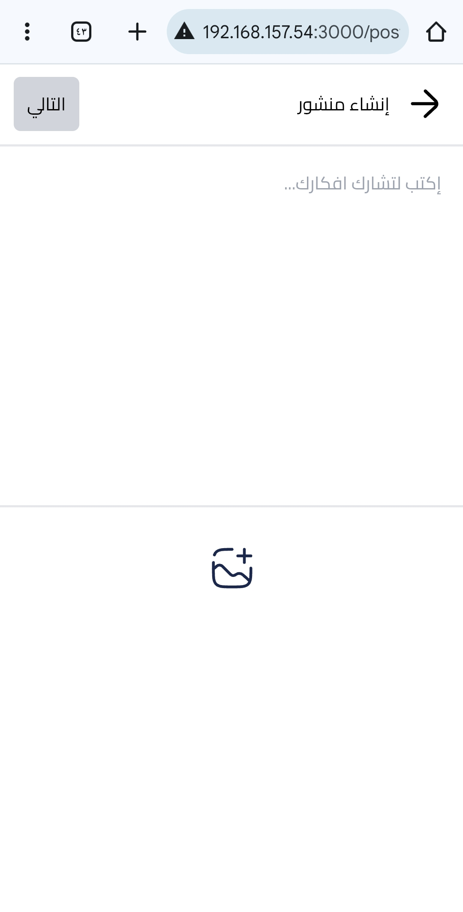
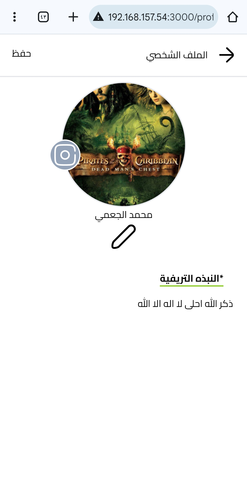

# about project
nasher is platform for posting and sharing whatever you want like post or post with photos and video any media you can sharing.

nasher build it in node js with express framework and another librarys, nasher very important platform.

I am going to taining module for classifier the post that is very important for give user posts according to his interest

# step for setup the project
1. npm install
2. download MongoDB database
3. open the browser
4. write in search: http://localhost:3000/
