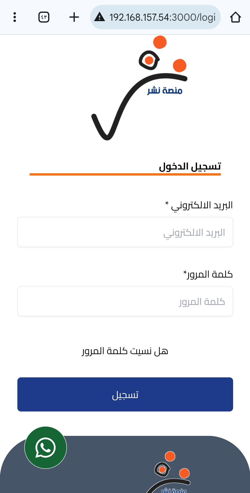
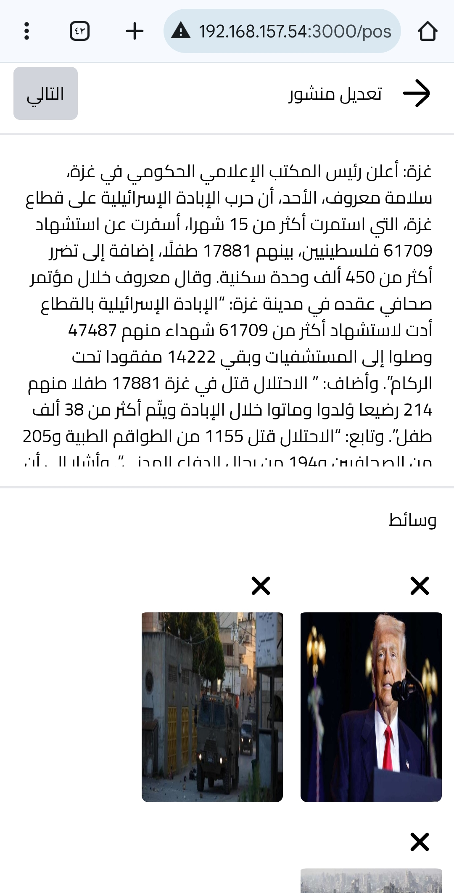
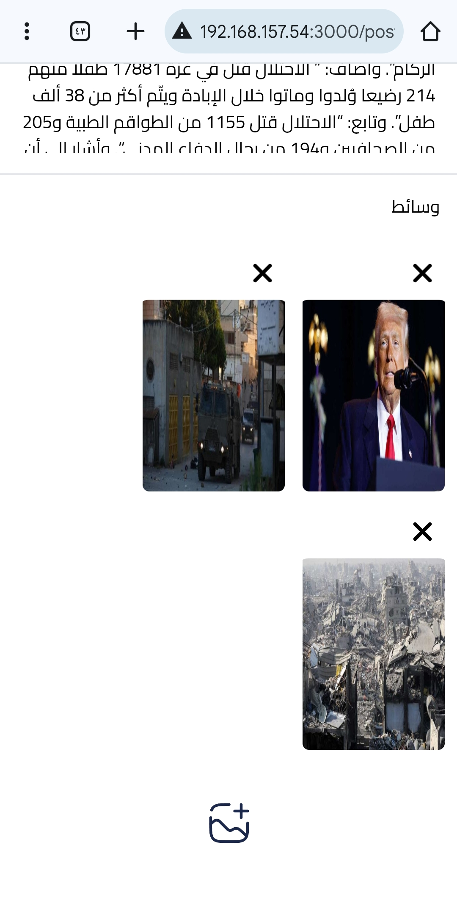
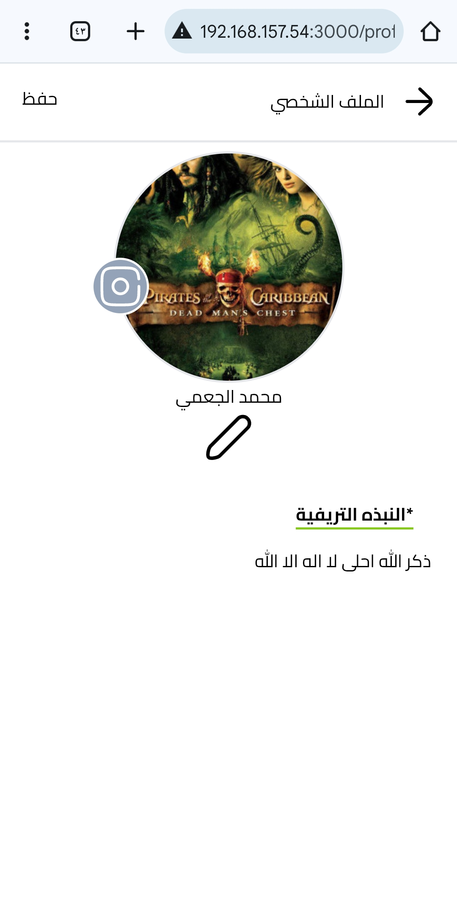
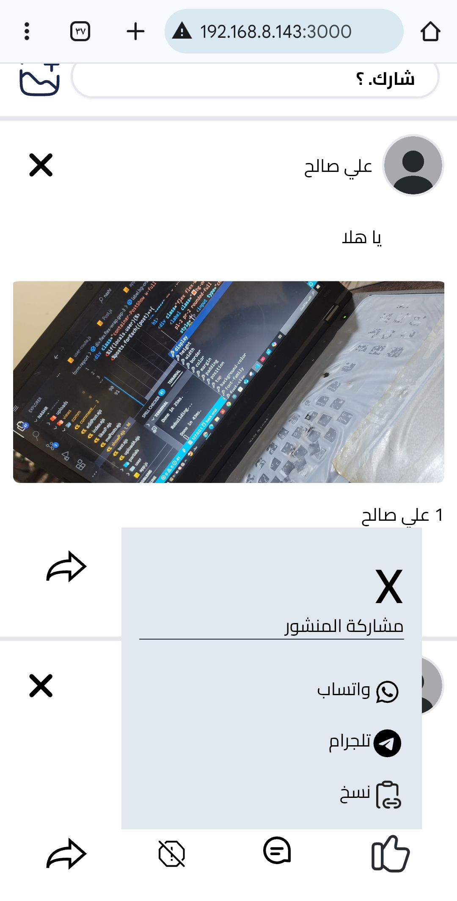
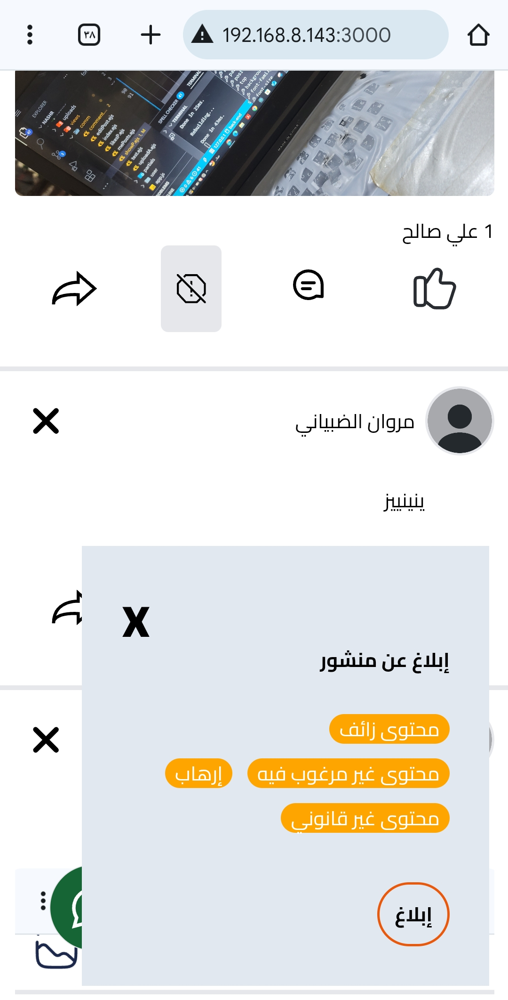
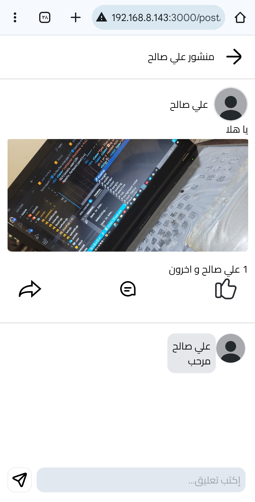

# photos from project

*==========================================

# about project
nasher is platform for posting and sharing whatever you want like post or post with photos and video any media you can sharing.

nasher build it in node js with express framework and another librarys, nasher very important platform.

I am going to taining module for classifier the post that is very important for give user posts according to his interest

# step for setup the project
1. run the command npm install
2. download MongoDB database for your devics
3. run the command node start
4. open the browser
5. write in search: http://localhost:3000/
